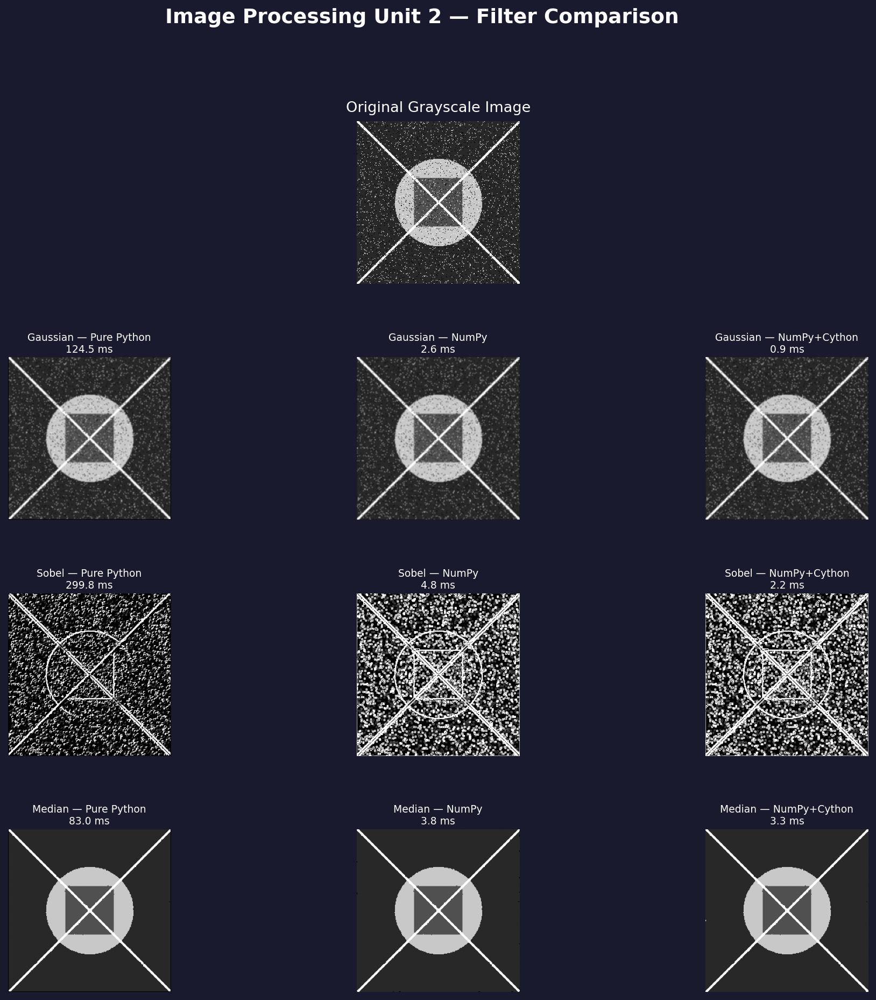

# Image Processing — Unit 2
**High Performance Computing | UPY — Séptimo Cuatrimestre**

Implementación y comparación de rendimiento de tres filtros de procesamiento de imágenes usando tres enfoques computacionales distintos.

---

## Filtros implementados

| Filtro | Propósito |
|--------|-----------|
| **Gaussian** | Suavizado / reducción de ruido |
| **Sobel** | Detección de bordes |
| **Median** | Eliminación de ruido sal y pimienta |

Cada filtro está implementado en tres versiones:
- **Pure Python** — solo built-ins de Python, sin librerías externas
- **NumPy** — operaciones vectorizadas con arreglos
- **NumPy + Cython** — extensiones C compiladas vía SciPy

---

## Estructura del repositorio

```
unit2_image_processing/
├── filters_pure_python.py     # Implementaciones en Python puro
├── filters_numpy.py           # Implementaciones vectorizadas con NumPy
├── filters_numpy_cython.py    # Implementaciones con SciPy / C compilado
├── main.py                    # Benchmark completo + visualización
├── requirements.txt           # Dependencias de Python
└── README.md                  # Este archivo
```

---

## Setup

### 1. Clonar el repositorio
```bash
git clone https://github.com/tu-usuario/unit2-image-processing.git
cd unit2-image-processing
```

### 2. Instalar dependencias
```bash
pip install -r requirements.txt
```

---

## Uso

### Correr cada módulo individualmente
Cada archivo de filtros incluye una demo con una imagen 8x8 para verificar que funciona correctamente:

```bash
python3 filters_pure_python.py
python3 filters_numpy.py
python3 filters_numpy_cython.py
```

### Correr el benchmark completo
```bash
# Con imagen sintética (por defecto):
python3 main.py

# Con tu propia imagen:
python3 main.py ruta/a/imagen.png
```

Esto genera:
- Tabla de tiempos en la terminal
- `results.png` — visualización comparativa de todos los filtros

---

## Resultados de rendimiento

Medidos en una imagen de **256x256 píxeles** (Pop!_OS, Python 3.12):

| Filtro | Pure Python | NumPy | NumPy+Cython | Speedup total |
|--------|-------------|-------|--------------|---------------|
| Gaussian | 124.51 ms | 2.61 ms | 0.93 ms | x134.1 |
| Sobel | 299.79 ms | 4.82 ms | 2.18 ms | x137.7 |
| Median | 82.98 ms | 3.85 ms | 3.34 ms | x24.9 |

### Conclusiones clave
- **NumPy** es entre 21.6x y 62.1x más rápido que Python puro solo por vectorizar las operaciones.
- **NumPy+Cython** agrega otro 2-3x sobre NumPy al usar rutinas C compiladas.
- El filtro **Median** se beneficia menos de la compilación porque el ordenamiento de valores es inherentemente secuencial.
- Python puro procesaría apenas ~3 imágenes/segundo con Sobel (299.79 ms/frame) — inviable para video en tiempo real.

---

## Visualización de resultados



---

## Dependencias

```
numpy>=1.24
Pillow>=10.0
scipy>=1.11
matplotlib>=3.7
reportlab>=4.0
```

---

## Equipo

Actividad realizada en equipo de 3 estudiantes — UPY, High Performance Computing, Séptimo Cuatrimestre.
